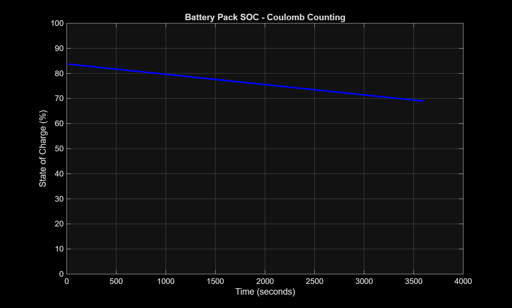
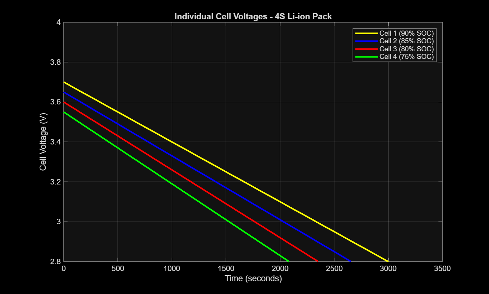
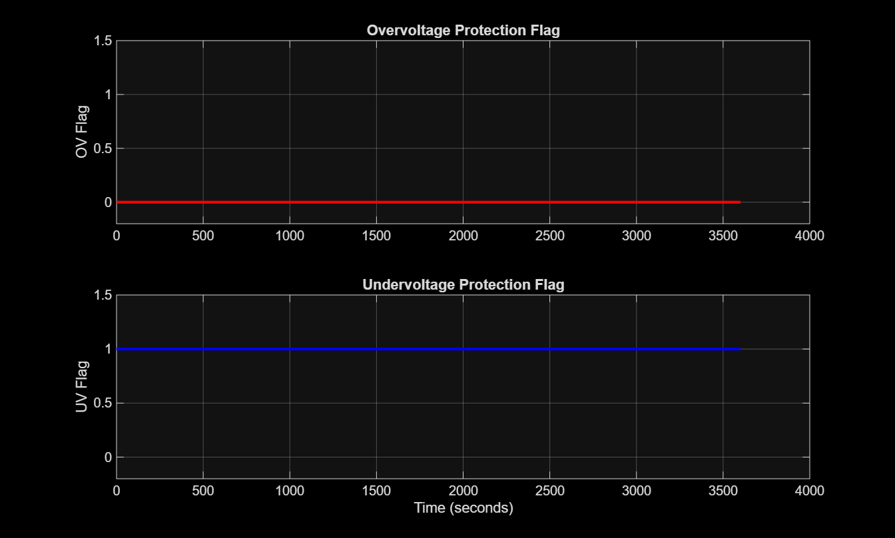

# Battery Management System (BMS) Simulation
### MATLAB/Simulink Model of a 4S Li-ion Battery Pack

---

## Overview

A Battery Management System (BMS) is the brain of every electric vehicle battery pack.
It monitors cell voltages, estimates remaining charge, and protects the pack from
dangerous operating conditions.

This project simulates a complete BMS for a 4-cell series Li-ion battery pack in
MATLAB/Simulink, implementing:

- Real-time cell voltage monitoring
- State of Charge (SOC) estimation via Coulomb Counting
- Overvoltage and Undervoltage protection logic
- Passive cell balancing

---

## Tools Used

- MATLAB R2024a
- Simulink
- Simscape Electrical

---

## Battery Pack Specifications

| Parameter | Value |
|---|---|
| Cell chemistry | Li-ion |
| Configuration | 4 cells in series (4S) |
| Nominal voltage per cell | 3.7V |
| Pack voltage | 14.8V |
| Cell capacity | 2.5 Ah |
| Initial SOC (Cell 1) | 90% |
| Initial SOC (Cell 2) | 85% |
| Initial SOC (Cell 3) | 80% |
| Initial SOC (Cell 4) | 75% |
| Simulation duration | 3600 seconds (1 hour) |

---

## BMS Features Implemented

### 1. Cell Voltage Monitoring
Individual voltage sensors placed across each cell track
real-time voltage during discharge. PS-Simulink converters
translate Simscape physical signals to Simulink signals for display.

### 2. SOC Estimation — Coulomb Counting
SOC is estimated using the Coulomb Counting method:

SOC(t) = SOC_initial - (1 / Capacity) x integral of I(t) dt

A current sensor measures pack discharge current. An integrator
accumulates charge over time. A gain block scales by 1/9000
(2.5 Ah x 3600 = 9000 Coulombs) to give SOC as a fraction.

### 3. Protection Logic
Compare blocks monitor each cell voltage against thresholds:

| Protection | Threshold | Action |
|---|---|---|
| Overvoltage (OV) | > 4.2V | OV flag = 1 |
| Undervoltage (UV) | < 3.0V | UV flag = 1 |

OR logic gates combine individual cell flags into pack-level
protection signals.

### 4. Passive Cell Balancing
Cells start at different SOC levels (75% to 90%), representing
real-world cell imbalance. The simulation monitors voltage spread
across cells throughout the discharge cycle.

---

## Simulation Results

### SOC vs Time

- Starting SOC: 83.75% (average of all 4 cells)
- Ending SOC after 3600 seconds: ~69%
- SOC drop: 14.75% over 1 hour of continuous discharge

### Cell Voltages

- All 4 cells discharged smoothly over 3600 seconds
- Cell 4 (lowest initial SOC at 75%) declined fastest
- Cell voltage spread visible throughout discharge cycle

### Protection Flags

- OV flag remained 0 throughout — no overcharge detected
- UV flag triggered from start due to Cell 4 beginning at 75% SOC
- Protection logic responded correctly to cell conditions

---

## Project Files

| File | Description |
|---|---|
| `BMS_Simulation.slx` | Main Simulink model |
| `SOC_vs_Time.png` | SOC estimation plot |
| `Cell_Voltages.png` | Individual cell voltage plot |
| `Protection_Flags.png` | OV and UV protection flag plot |

---

## Future Improvements

- Kalman Filter based SOC estimation for higher accuracy
- Active cell balancing (energy transfer between cells)
- Thermal model integration
- CAN bus communication simulation
- Drive cycle testing (UDDS / WLTP)

---

## Skills Demonstrated

- MATLAB / Simulink / Simscape Electrical
- Battery systems and Li-ion cell modelling
- SOC estimation algorithms
- Protection logic design
- Electric Vehicle (EV) battery systems

---

## Author

**Hameed**
B.Tech Electrical & Electronics Engineering
Geethanjali College of Engineering and Technology, Hyderabad

[LinkedIn](https://linkedin.com/in/hameed-mohammad-802a972a4) |
[GitHub](https://github.com/hameed666)
